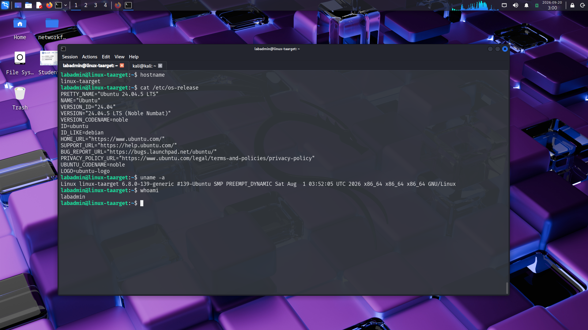
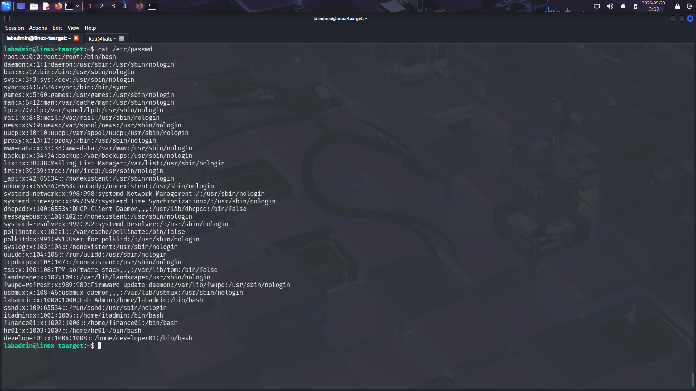
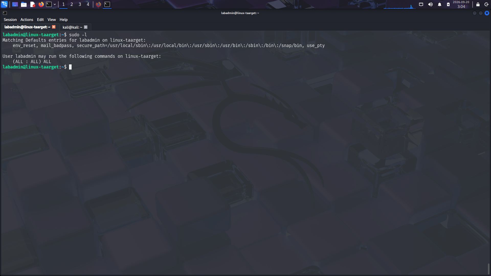
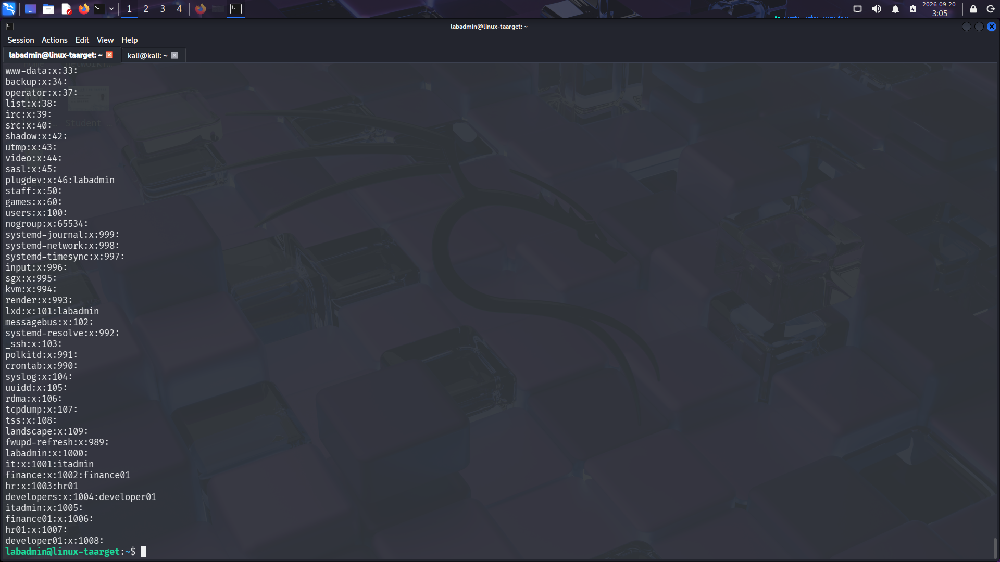
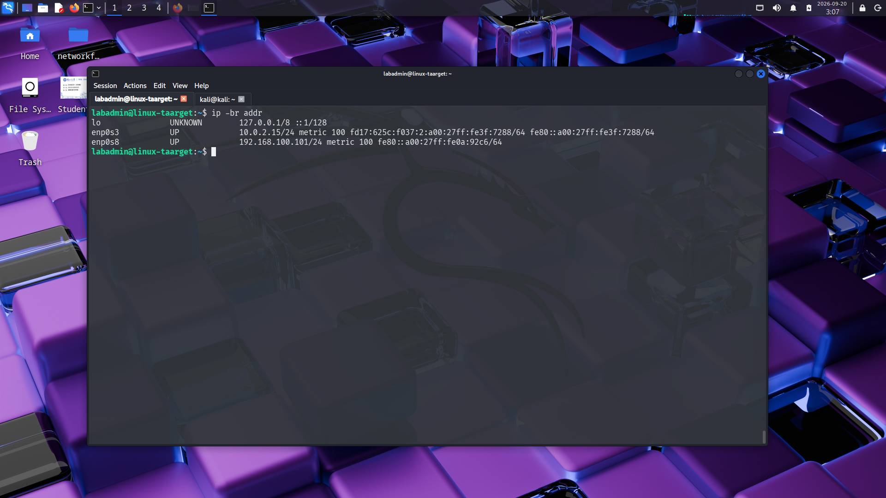
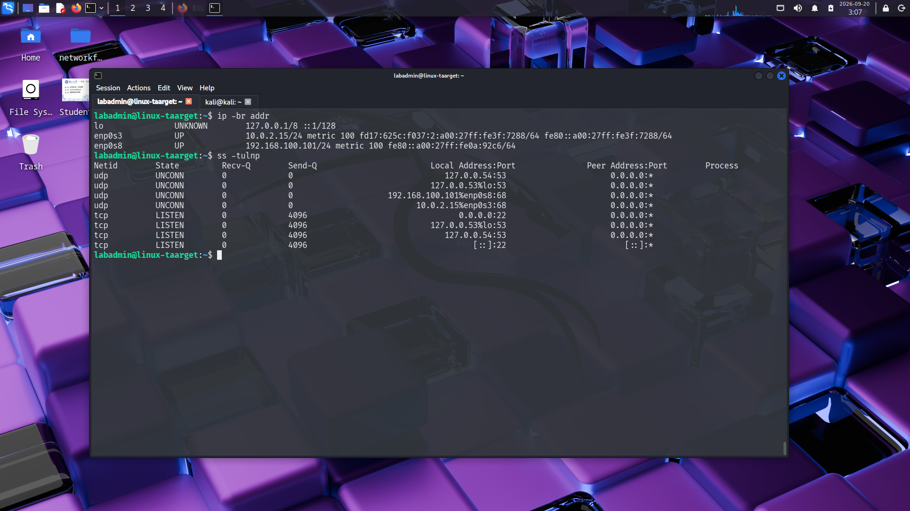
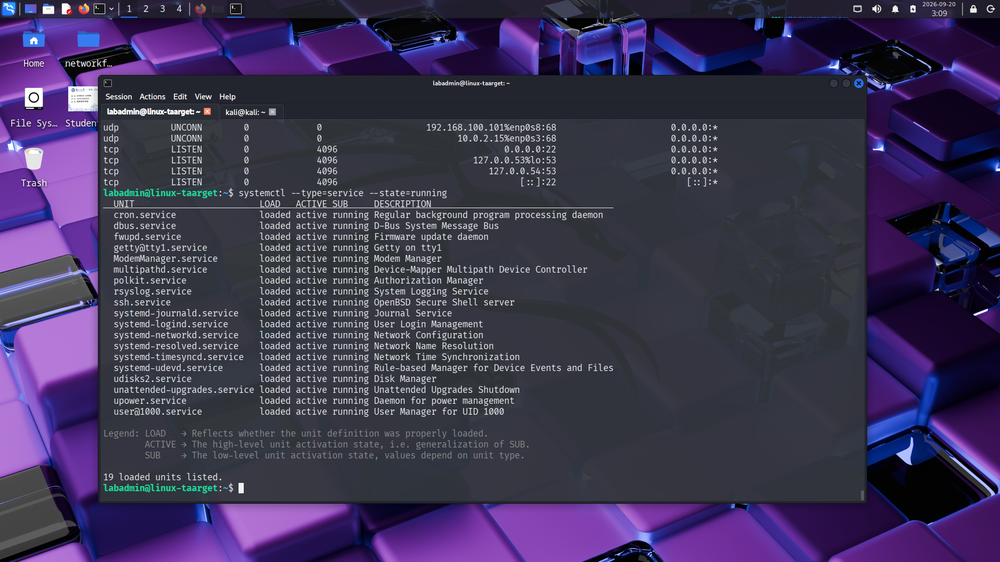
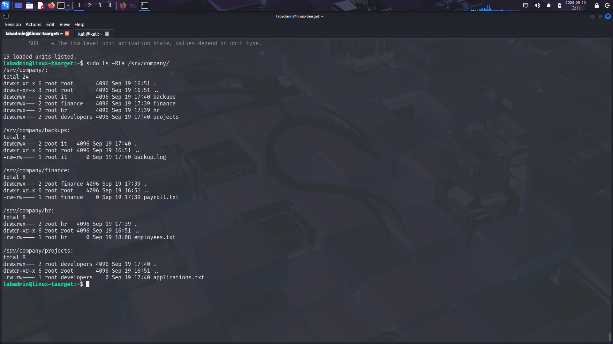

# Baseline Assessment

## 1. Purpose

This document establishes the baseline state of the Ubuntu Linux target before the formal security assessment begins.

The baseline records the system configuration, users, privileges, network exposure, running services, and departmental resources present during the environment construction phase.

The captured evidence provides a reference point for the later assessment, remediation, and validation phases.

---

## 2. Target Overview

The target is an Ubuntu Linux server configured to represent an enterprise server within an isolated security laboratory.

The server contains resources for four simulated departments:

- Finance
- Human Resources
- Development
- IT Operations

The target is connected to the internal laboratory network and will later be assessed from Kali Linux.

---

## 3. System Identity

### Objective

Establish the identity and basic system information of the target.

### Evidence

### Observations

The baseline identifies the target as:

| Item | Value |
|---|---|
| Hostname | `linux-taarget` |
| Operating System | Ubuntu 24.04.5 LTS |
| Kernel | `6.8.0-139-generic` |
| Architecture | x86_64 |
| Current User | `labadmin` |

This establishes the platform and system identity used throughout the assessment.

---

## 4. Local User Accounts

### Objective

Identify the local accounts configured on the target.

### Evidence

### Observations

The system contains the following organizational accounts:

| User | UID | Role |
|---|---:|---|
| `labadmin` | 1000 | System administrator |
| `itadmin` | 1001 | IT administrator |
| `finance01` | 1002 | Finance user |
| `hr01` | 1003 | HR user |
| `developer01` | 1004 | Development user |

The system also contains standard Linux system and service accounts required by Ubuntu.

Local accounts establish the authentication identities that may be relevant during later security testing.

---

## 5. Administrative Privileges

### Objective

Determine the administrative privileges assigned to the baseline administrative account.

### Evidence

### Observations

The `labadmin` account has unrestricted sudo access:

    (ALL : ALL) ALL

This permits the account to execute commands with elevated privileges through sudo.

The account was intentionally used for administrative tasks during environment construction.

Its security implications will be evaluated during the assessment phase.

---

## 6. Local Groups

### Objective

Identify the groups used to organize departmental access.

### Evidence

### Observations

The environment contains department-specific groups:

| Group | Purpose |
|---|---|
| `it` | IT Operations resources |
| `finance` | Finance resources |
| `hr` | Human Resources resources |
| `developers` | Development resources |

Organizational users are associated with their respective departmental groups.

These groups form the primary access-control mechanism for departmental resources.

---

## 7. Network Configuration

### Objective

Establish how the target is connected to the laboratory network.

### Evidence

### Observations

The target has two active network interfaces:

| Interface | Address | Network | Purpose |
|---|---|---|---|
| `enp0s3` | `10.0.2.15/24` | NAT | Temporary Internet access |
| `enp0s8` | `192.168.100.101/24` | Internal Network | Security laboratory network |

The internal interface provides connectivity between the Ubuntu target and the other systems in the isolated laboratory.

The internal address `192.168.100.101` is the primary address used for the security assessment.

---

## 8. Listening Network Services

### Objective

Identify network services currently listening for connections on the target.

### Evidence

### Observations

The baseline shows:

- TCP port `22` listening on all IPv4 interfaces
- TCP port `22` listening on all IPv6 interfaces
- Local DNS resolver services on loopback
- DHCP-related UDP activity on the configured interfaces

The primary externally reachable service identified at baseline is SSH:

    TCP 0.0.0.0:22
    TCP [::]:22

Listening services define part of the host's network attack surface and will therefore be examined during the assessment.

---

## 9. Running Services

### Objective

Record the services actively running on the Ubuntu server.

### Evidence

### Observations

The baseline shows active system services including:

- `cron`
- `dbus`
- `getty@tty1`
- `ModemManager`
- `multipathd`
- `polkit`
- `rsyslog`
- `ssh`
- `systemd-journald`
- `systemd-logind`
- `systemd-networkd`
- `systemd-resolved`
- `systemd-timesyncd`
- `systemd-udevd`
- `udisks2`
- `unattended-upgrades`
- `upower`
- `user@1000`

The running-service inventory provides the initial service state against which later assessment and remediation changes can be compared.

---

## 10. Company Resources and Access Control

### Objective

Record the departmental resources, ownership, group assignments, and permissions configured on the target.

### Evidence

### Observations

Departmental resources are stored under:

    /srv/company/

The resource structure is:

| Resource | Department | Owner | Group |
|---|---|---|---|
| `/srv/company/finance` | Finance | root | finance |
| `/srv/company/hr` | Human Resources | root | hr |
| `/srv/company/projects` | Development | root | developers |
| `/srv/company/backups` | IT Operations | root | it |

### Finance

    Directory: root:finance
    Permissions: rwxrwx---

    File: payroll.txt
    Owner: root
    Group: finance
    Permissions: rw-rw----

### Human Resources

    Directory: root:hr
    Permissions: rwxrwx---

    File: employees.txt
    Owner: root
    Group: hr
    Permissions: rw-rw----

### Development

    Directory: root:developers
    Permissions: rwxrwx---

    File: applications.txt
    Owner: root
    Group: developers
    Permissions: rw-rw----

### IT Operations

    Directory: root:it
    Permissions: rwxrwx---

    File: backup.log
    Owner: root
    Group: it
    Permissions: rw-rw----

The configured permissions establish departmental boundaries through Linux ownership and group membership.

These boundaries will later be tested from the perspective of an unauthorized user.
